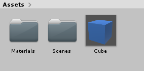
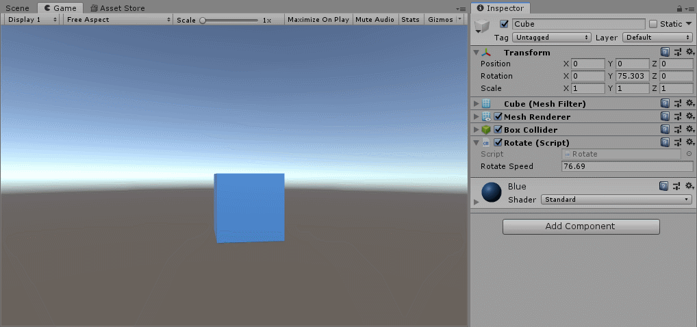
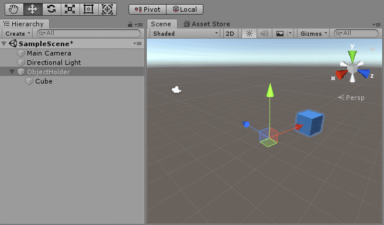

# Click Navigation Project

Unity Version: 2018.4f

## Build

First walk through the presentation that shows off what the project is composed of and what we'll be building.

### Step 1: Building the Prefab

The prefab is going to be an empty GameObject with a parent.

First we just need to build a cube and give it color.

- Create a cube in the hierarchy.

- Create a materials folder.

- Create a material to assign to the cube.

- Make the cube into a prefab.



### Step 2: Rotate.cs

The first script is simple, a rotation about the y-axis.

- Create a *"Scripts"* folder.

- Write the *"Rotate.cs"* script

Rotate.cs

```csharp
using UnityEngine;

public class Rotate : MonoBehaviour
{
    public float rotateSpeed = 1f;

    void Update()
    {
        // Multiply vector (0,1,0) by the speed and deltaTime every frame
        transform.Rotate(Vector3.up * rotateSpeed * Time.deltaTime);
    }
}
```

- Attach the script to the cube.

- Press play and manipulate the speed.



### Step 3: Creating a Parent

Having a parent with all of the transform scripts gives us more control in the editor.

- Create an empty `GameObject` named *ObjectHolder* in the inspector.

- Parent *Cube* to *ObjectHolder*.

- Delete the *Cube* Prefab and replace it with *ObjectHolder*.

- Delete the *Rotate.cs* script from *Cube* and attach it to *ObjectHolder*.

Now, we can change how the rotation affects the cube by moving it away from the origin.

- Set the cube to local position (0,0,0).

- Press play and show the cube rotate in place.

- Move the cube to local position (3,0,0).

- Set the axes to local in the toolbar.

- Press play and show the cube rotation around its parent in the scene view.

- Move the parent around in the scene to show that the cube always stays with its parent.



### Step 4: BackForth.cs

