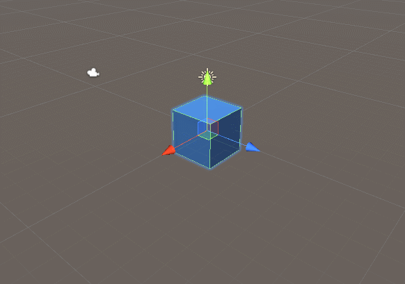
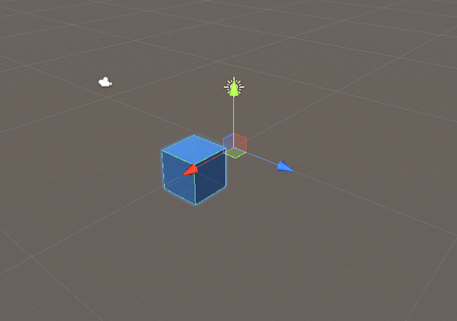
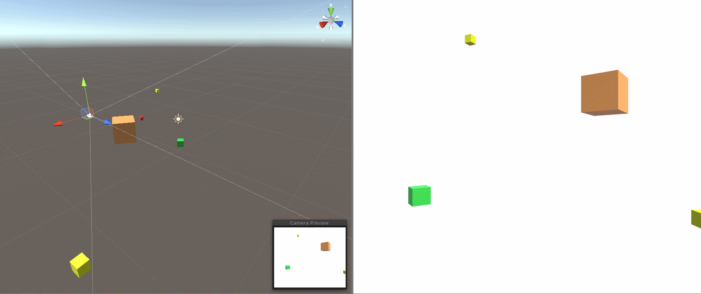

# Click Navigation Project

Unity Version: 2018.4f

## Build

First walk through the presentation that shows off what the project is composed of and what we'll be building.

### Step 1: Building the Prefab

The prefab is going to be an empty GameObject with a parent.

First we just need to build a cube and give it color.

- Create a cube in the hierarchy.

- Create a materials folder.

- Create a material to assign to the cube.

- Make the cube into a prefab.


### Step 2: Rotate.cs

The first script is simple, a rotation about the y-axis.

- Create a *"Scripts"* folder.

- Write the *"Rotate.cs"* script

Rotate.cs

```csharp
using UnityEngine;

public class Rotate : MonoBehaviour
{
    public float rotateSpeed = 1f;

    void Update()
    {
        // Multiply vector (0,1,0) by the speed and deltaTime every frame
        transform.Rotate(Vector3.up * rotateSpeed * Time.deltaTime);
    }
}
```

- Attach the script to the cube.

- Press play and manipulate the speed.


### Step 3: Creating a Parent

Having a parent with all of the transform scripts gives us more control in the editor.

- Create an empty `GameObject` named *ObjectHolder* in the inspector.

- Parent *Cube* to *ObjectHolder*.

- Delete the *Cube* Prefab and replace it with *ObjectHolder*.

- Delete the *Rotate.cs* script from *Cube* and attach it to *ObjectHolder*.

Now, we can change how the rotation affects the cube by moving it away from the origin.

- Set the cube to local position (0,0,0).

- Press play and show the cube rotate in place.

- Move the cube to local position (3,0,0).

- Set the axes to local in the toolbar.

- Press play and show the cube rotation around its parent in the scene view.

- Move the parent around in the scene to show that the cube always stays with its parent.


### Step 4: GrowShrink.cs

GrowShrink.cs

```csharp
using UnityEngine;

public class GrowShrink : MonoBehaviour
{
    public float maxSize = 3f;

    public float minSize = 0.5f;
    public float scaleSpeed = 1f;

    Transform childTransform;

    bool growing = true;

    void Awake()
    {
        // Get a reference to the child transform.
        childTransform = transform.GetChild(0).transform;
    }

    void Start()
    {
        childTransform.localScale = Vector3.one;
    }

    // Update is called once per frame
    void Update()
    {
        // Check if the child has passed the maximum distance, if so, change the direction.
        if (childTransform.localScale.x >= maxSize) {
            growing = false;
        } else if (childTransform.localScale.x <= minSize) {
            growing = true;
        }

        // Check which direction the child is moving, then move its position in that direction.
        if (growing) {
            childTransform.localScale += Vector3.one * scaleSpeed * Time.deltaTime;
        } else {
            childTransform.localPosition -= Vector3.one * scaleSpeed * Time.deltaTime;
        }
    }
}
```



### Step 5: BackForth.cs

The *BackForth.cs* script will move the object back and forth across the origin. We can accomplish the same oscillating behavior we saw in GrowShrink by representing the motion with a sin wave.

BackForth.cs

```csharp
using UnityEngine;

public class BackForth : MonoBehaviour
{

    public float moveSpeed = 1f;

    public float maxDistance = 3f;

    private Transform childTransform;

    void Awake()
    {
        // Get a reference to the child's transform
        childTransform = transform.GetChild(0).transform;
    }

    void Start()
    {
        // Start the child object at parent's origin.
        childTransform.localPosition = Vector3.zero;
    }

    void Update()
    {
        // Move the child back and forth.
        childTransform.localPosition = Vector3.right * Mathf.Sin(Time.time * moveSpeed) * maxDistance;
    }
}
```



### Step 6: Random Spawner

Now we can create the Random Spawner Script


- Create an empty GameObject called *RandomSpawner*

- Create a script called `RandomSpawn.cs` and attach it to the *RandomSpawner*.

- In the script expose a variable `objectToSpawn` that holds a GameObject. This is for our prefab.

- Create a private method called `Spawn()` that instantiates a GameObject and sets its position.

- Create a loop that runs an amount of times controlled by the user. Call Spawn() in this loop.

This will instantiate as many objects as the user wants.

RandomSpawn.cs

```csharp
using UnityEngine;

public class RandomSpawn : MonoBehaviour
{
    [SerializeField] GameObject objectToSpawn;
    [SerializeField] int amountToSpawn;

    void Start() {
        for (int i = 0; i < amountToSpawn; i++) {
            Spawn();
        }
    }

    void Spawn() {
        GameObject obj = Instantiate(objectToSpawn);
        obj.transform.position = Vector3.up * Random.Range(-5f, 5f);
    }
}
```

### Step 7: Modifying Public Variables

Inside the `Spawn()` method, we'll be randomly assigning values from the `Random.Range()` method.

```csharp

    void Spawn() {
    GameObject obj = Instantiate(objectToSpawn);

    // Randomly set materials
    MeshRenderer mr = obj.GetComponentInChildren<MeshRenderer>();
    mr.material = materials[Random.Range(0, materials.Length)];

    // Randomly set Rotate values
    Rotate rotate = obj.GetComponent<Rotate>();
    rotate.rotateSpeed = Random.Range(10f, 60f);

    // Randomly set GrowShrink values
    GrowShrink growShrink = obj.GetComponent<GrowShrink>();
    growShrink.scaleSpeed = Random.Range(1f, 2f);
    growShrink.maxSize = Random.Range(1f, 3f);
    growShrink.minSize = Random.Range(0.1f, 0.5f);

    // Randomly set BackForth values
    BackForth backForth = obj.GetComponent<BackForth>();
    backForth.maxDistance = Random.Range(5f, 10f);
    backForth.moveSpeed = Random.Range(1f, 3f);

    // Spawn in random y axis. 
    obj.transform.position = Vector3.up * Random.Range(-5f, 5f);
}

```

### Step 8: Random Colors

The scene will look better if we have variations in color.

- In the *Materials* folder, add 6 or so materials with bright colors.

- In the `RandomSpawn.cs` script, expose a `Material` array.

```csharp
[SerializeField] Material[] materials;
```

- In the `Spawn()` method, randomly assign a material from the array to the `MeshRenderer` of the object.

```csharp
// Randomly set materials
MeshRenderer mr = obj.GetComponentInChildren<MeshRenderer>();
mr.material = materials[Random.Range(0, materials.Length)];
```

### Step 9: Flat Background and Framing

- In the *Main Camera* of the scene, change the *Clear Flags* to *Solid Color* and pick a white background.

- Frame the camera so it captures the spawn points of the objects. (0, 0, -15) is a good position value.



### Step 10: Rotate the Cube and the Parent

- Add a *Rotate.cs* script to the cube.

- In `Spawn()` Get the `Rotate` of the child and set the values randomly.

```csharp
 // Randomly set Rotate values
Rotate rotate = obj.GetComponent<Rotate>();
rotate.rotateSpeed = Random.Range(10f, 60f);

Rotate childRotate = obj.transform.GetChild(0).GetComponent<Rotate>();
childRotate.rotateSpeed = Random.Range(90f, 180f);
```

### Step 11: Adding User Control

When the user presses the spacebar, spawn another object.

In `RandomSpawn.cs`

```csharp
void Update() {
    if (Input.GetKeyDown(KeyCode.Space)) {
        Spawn();
    }
}
```
